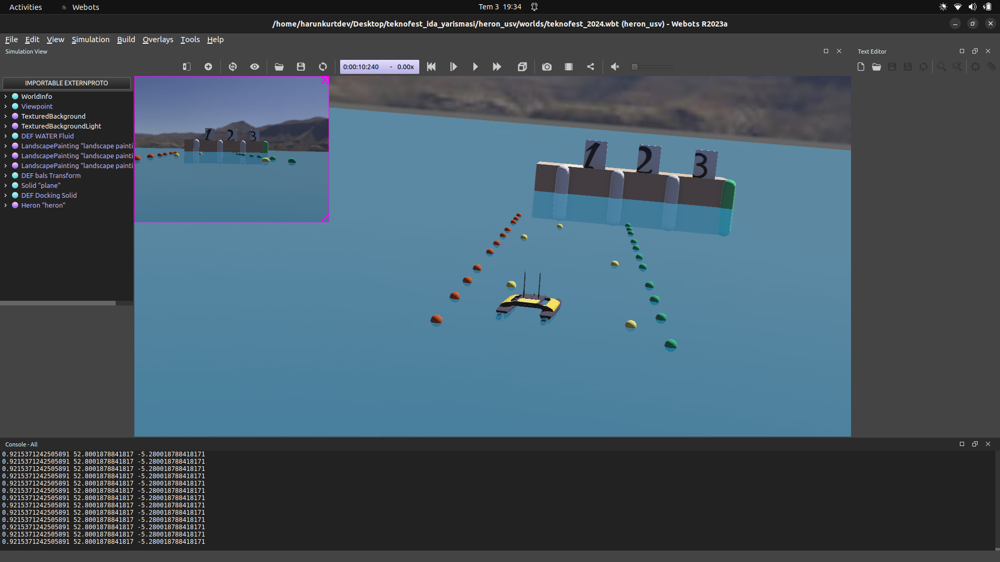
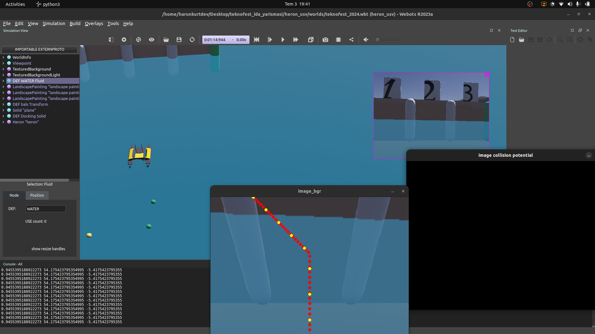

# TİDA 2025

[video_link](https://youtu.be/VB5z4U7GiJE)

Merhaba Arkadaşlar,

Bu çalışmayı Webots için geliştirmekteki olduğum Clearpath'a ait Heron USV aracımıza ait bir çalışmadır.
Bu çalışmanın başlıca özelliği, yarışmaya uygun bir şekilde aracımıza özellikler katmaya çalıştım.
Bunu basit bir şekilde yapmaya çalıştım.
Umarım faydalı olmuştur.

Kullandığım methodlar;
A* 
Perspective View
PID
Potential Field
HSV Colorize

Görünrüt işlemeyle görüntüyü, HSV uzayından kırmızı, sarı ve yeşil renklerin ayırımı ile bu renkleri engel olarak ayarladıktan sonra  Potential Field üzerine koydum, engel olarak gözüken dubalar A* path planning algoritmasından geçerek, path bulma işlemi sağlanmaktadır.

PID ile Heading kontrolü yanı sıra A* 'dan gelen path'ı trajectory'e dönüştürmekteyim ve bu trajectory ile aracımıza heading kontrolü sağlanmaktadır.

Ufak bir Seri anlatacağım bu konuyla ilgili. Takipte kalabilirsiniz.

"Simülasyon gerçek dünyanın yansımasıdır."

